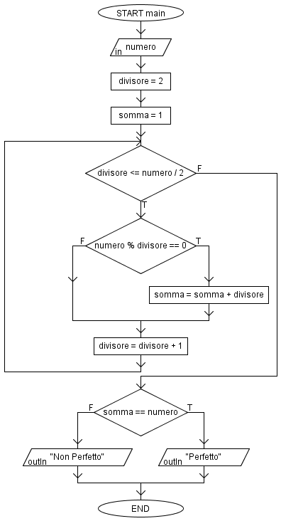

# Numero perfetto

Dato un numero N in input, stabilire se questo è perfetto o meno.
> Un numero di dice perfetto quando è pari alla somma dei suoi divisori.

### Esempio
Il numero 6 è perfetto in quanto la somma dei suoi divisori 1,2,3 è uguale a 6.
Altri numeri perfetti sono: 1, 6, 28, 496, 8128 etc.

### Flow Chart

## Autore
[Giovanni Figliuolo](https://giovannifigliuolo.it)
