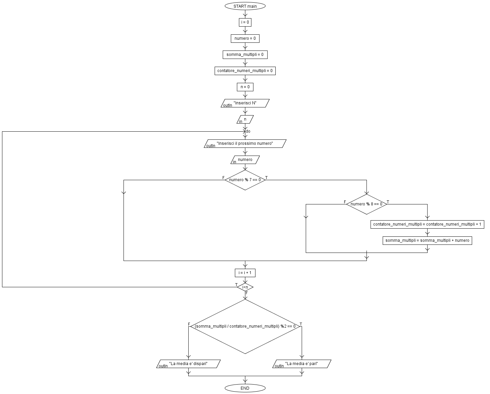

# Multipli di 7 e 8

Dato un numero N in input, verificare se sono contemporaneamente multipli di 7 e 8.
Stampare a video se la media dei numeri è pari o dispari.

### Esempio
Inserisco i numeri 44,344,56,220, 224.
In questo caso, i numeri che sono contemporaneamente multipli di 7 e 8 sono: 56 e 224.
La media dei numeri risulta pari in quanto la somma dei numeri 56+224 è 280 e la media è 240.

### Output
Esempio di esecuzione del programma

### Flow Chart

## Autore
[Giovanni Figliuolo](https://giovannifigliuolo.it)