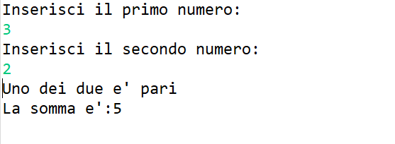
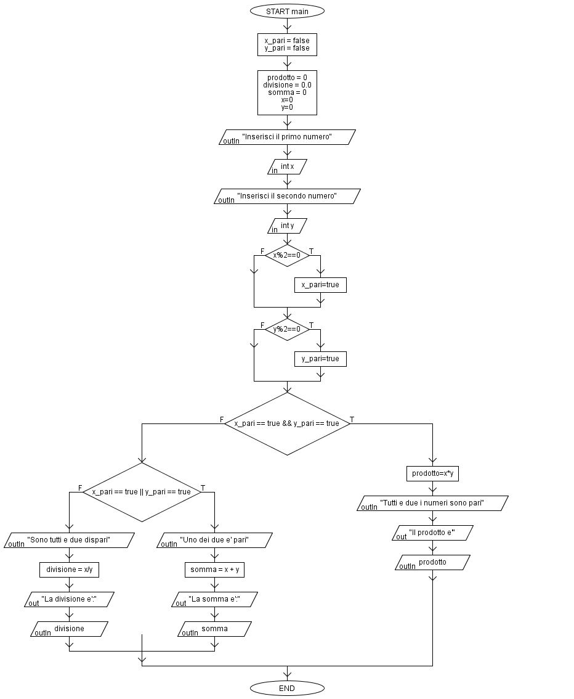

# Pari o Dispari
## Traccia
>Dati 2 numeri interi in input:
>-stampare il prodotto se sono entrambi pari
>-stampare la somma se almeno uno e' pari
>-stampare la divisione se sono entrambi dispari

### Esempio
Inserisco i numeri 44,33.
In questo caso, viene effettuata e stampata la somma ```44 + 33 = 77``` in quanto solo uno dei due è pari.

### Output
Esempio di esecuzione del programma



### Flow Chart



## Autore
[Giovanni Figliuolo](https://giovannifigliuolo.it)