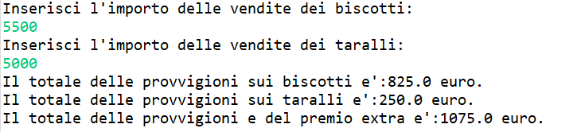
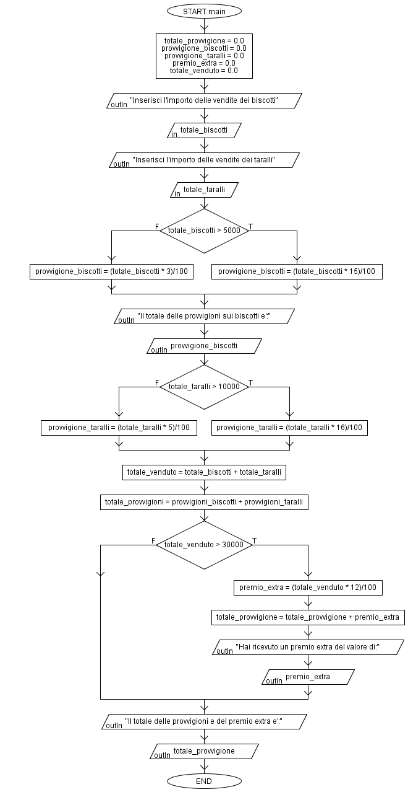

# Provvigioni Venditore
## Traccia
>Un venditore inserisce l'importo delle vendite di biscotti e taralli.
>Se vende più di 5.000€ di biscotti riceve una provvigione del 15%, altrimenti del 3%.
>Se vende più di 10.000€ di taralli riceve una provvigione del 16%, altrimenti del 5%.
>Se il totale delle vendite e' maggiore di 30.000€, riceve un premio extra del 12%.
>Stampare a video gli importi delle provvigioni, l'importo del totale delle provvigioni e >dell'eventuale premio extra.

### Output
Esempio di esecuzione del programma

### Flow Chart

## Autore
[Giovanni Figliuolo](https://giovannifigliuolo.it)
